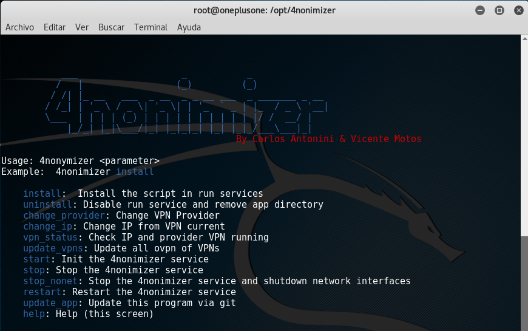
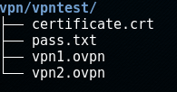
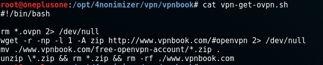

# What is 4nonimizer?

It is a bash script for anonymizing the public IP used to browsing Internet, managing the connection to TOR network and to different VPNs providers (OpenVPN), whether free or paid. By default, it includes several pre-configured VPN connections to different peers (.ovpn files) and download the credentials. Also, it records each used IP that we use every 300 seconds in log files.

This script is enabled as a service in systemd systems and uses a default vpn (VPNBook) at system startup.

# Installation 

Download the repo using git, execute the command **./4nonimizer install** in the directory, and follow the screen instructions, 4nonimizer will move to the directory **/opt/** and installed as a service.

This script has full compatibility with Kali Linux, although it has been properly tested and should also work on other distributions like Debian, Ubuntu and Arch (Manjaro). However there could be some bugs, or unexpected performances (please comments if you find any!).

# Options

Once installed 4nonymizer, enter the command **4nonimizer help** to get the help, which shows all the available parameters:

# Available VPNs

Currently it supports the following VPN providers:

\- HideMyAss <https://www.hidemyass.com/>

\- TorGuard <https://torguard.net/>

\- VPNBook (por defecto) <http://www.vpnbook.com/>

\- VPNGate <http://www.vpngate.net/en/>

\- VPNMe <https://www.vpnme.me/>

\- VPNKeys <https://www.vpnkeys.com/>

# Install a new VPN

To install an additional vpn we have to use the following structure in order to the 4nonimizer be able to integrate and perform operations with it.

First, we have to create the following dir structure **/vpn/** within 4nonimizer path:

In our example we create the folder **/vpntest/** and within it placed all **.ovpn** files we have. If the files ovpn not have the certificate within each of them we put in the same folder as shown in the example **certificate.crt**.

In addition, we must place a file named **pass.txt** containing 2 lines: the first one with the username and the second one with the password, as shown below:

If we have correctly performed all steps when we execute the command **4nonimizer change_provider** the menu will show our vpn:

As you can see in the picture, option [7] it is the vpn we've created.

# Getting credencials and ovpn files automatically

If the VPN provider allows automation of credential and/or .ovpn files getting, 4nonimizer has standardized the following scripts names and locations:

\- /opt/4nonimizer/vpn/provider/**vpn-get-pass.sh**

\- /opt/4nonimizer/vpn/provider/**vpn-get-ovpn.sh**

4nonimizer automatically detect the presence of both scripts and indicate (Auto-pass Login) or (Auto-get OVPN) if applicable.

# Extras

\- Execute 'source 4nonimizer' to activate autocompletation of parameters.
\- Copy .conkyrc in your home directory to load a 4nonimizer template and execute conky.  

# References

\- http://www.hackplayers.com/2016/08/tuto-enmascarar-ip-linux-vpn-tor.html  
\- http://www.hackplayers.com/2016/10/4nonimizer-un-script-para-anonimizar-ip.html  

# Versions

\- 1.0-beta codename .bye-world! 5/10/2016

¡4nonimize the world!

-------------------------------------------------------------------------------------------------------------------------------------------------------------------------------
# SPANISH TRANSLATION
-------------------------------------------------------------------------------------------------------------------------------------------------------------------------------

# ¿Que es 4nonimizer?

Es un script en bash cuyo objetivo es anonimizar (de momento) la IP pública con la que salimos a Internet mediante la gestión del proceso de conexión a TOR y a distintos proveedores VPNs (OpenVPN), ya sean gratuitos o de pago. Por defecto incluye preconfiguradas varias VPN gratuitas automatizando la conexión a distintos peers y la descarga de credenciales correspondientes. Además por defecto registra en ficheros logs la IP que usamos cada 300 segundos. 

Este script se habilita como servicio en sistemas systemd y levanta la vpn por defecto (VPNBook) en el inicio del sistema.

# Instalación 

Descargar el repositorio mediante git , ejecutar la instruccion **./4nonimizer install** dentro del directorio, y seguir las intrucciones por pantalla, 4nonimizer se moverá al directorio **/opt/** y se instalará como servicio.

Este script tiene compatibilidad completa con Kali Linux, aunque ha sido probado y debería funcionar correctamente también en otras distribuciones como Debian, Ubuntu y Arch (Manjaro). No obstante podrían darse algunos bugs, o funcionamientos inesperados (¡por favor, comenta si encuentras alguno!).

# Opciones

Una vez instalado 4nonimizer, introduce el comando **4nonimizer help** para obtener la ayuda, la cual nos muestra todos los parámetros disponibles:

# VPNs disponibles

Actualmente se soportan los siguientes proveedores VPN:

\- HideMyAss <https://www.hidemyass.com/>

\- TorGuard <https://torguard.net/>

\- VPNBook (por defecto) <http://www.vpnbook.com/>

\- VPNGate <http://www.vpngate.net/en/>

\- VPNMe <https://www.vpnme.me/>

\- VPNKeys <https://www.vpnkeys.com/>

# Instalar una nueva VPN

Para poder instalar una vpn adicional tendremos que tener en cuenta la siguiente estructura para que 4nonimizer la integre en el script y pueda realizar operaciones con ella.

Lo primero, deberemos de crear la siguiente estructura en la carpeta **/vpn/** dentro de la ruta de 4nonimizer:

En nuestro ejemplo creamos la carpeta **/vpntest/** y dentro de ella colocamos todos los **.ovpn** que dispongamos. En caso de que los ficheros ovpn no tuvieran el certificado dentro de cada uno de ellos lo deberemos poner en la misma carpeta como se muestra en el ejemplo **certificate.crt**.  

Además de todo ésto deberemos de colocar un fichero llamado **pass.txt** que contenga 2 líneas: en la primera el usuario y en la segunda la contraseña, como se muestra a continuación:

Si hemos realizado correctamente todos los pasos cuando escribamos el comando **4nonimizer change_provider** nos deberá de mostrar nuestra vpn :

Como se puede apreciar en la imagen la opcion [7] es la vpn que hemos creado.

# Automatización de la obtención de credenciales y ficheros ovpn

Si el proveedor correspondiente permite la automatización de la obtención de credenciales y/o ficheros .ovpn, 4nonimizer tiene normalizado que los scripts correspondientes tengan la ubicación y nombres siguientes:

\- /opt/4nonimizer/vpn/provider/**vpn-get-pass.sh**

\- /opt/4nonimizer/vpn/provider/**vpn-get-ovpn.sh**

4nonimizer automáticamente detectará la presencia de ambos scripts e indicará (Auto-pass Login) o (Auto-get OVPN) si procede.

# Extras

\- Ejecuta 'source 4nonimizer' para habilitar el autocompletado de parámetros.
\- Copia .conkyrc en tu directorio home para cargar la plantila de 4nonimizer y ejecuta conky.  

# Referencias

\- http://www.hackplayers.com/2016/08/tuto-enmascarar-ip-linux-vpn-tor.html  
\- http://www.hackplayers.com/2016/10/4nonimizer-un-script-para-anonimizar-ip.html  

# Versiones

\- 1.0-beta codename .bye-world! 5/10/2016

¡4nonimiza el mundo!

